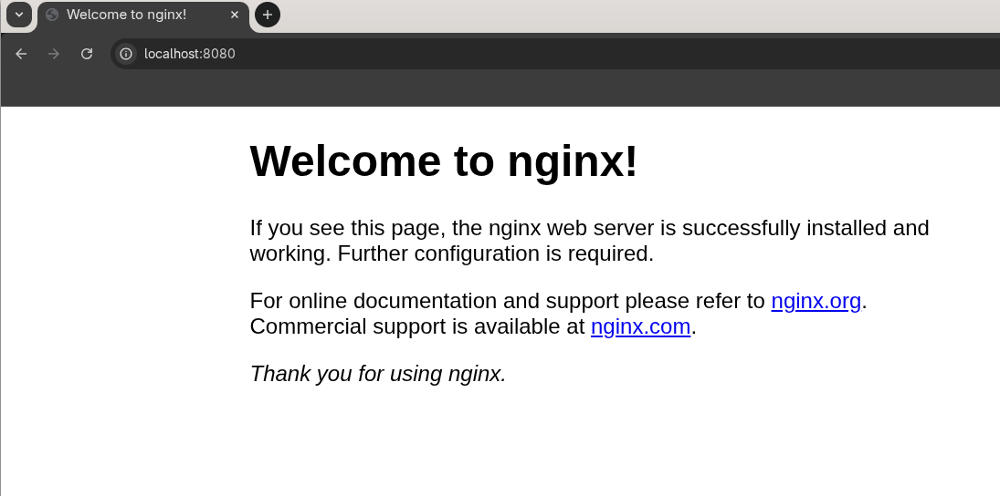

# Esercizio 5 – Service

## 🎯 Obiettivo

Esporre i Pod tramite un endpoint stabile.

## ❓ Problema

I Pod:

* hanno un IP
* ma quell’IP **può cambiare**

👉 Non sono affidabili per accedere all’app

Se l’IP cambia, come facciamo a raggiungere sempre l’applicazione? La soluzione
consiste nell'utilizzare un Service, che fornisce:

* un nome fisso
* un IP stabile
* punto di accesso unico

👉 anche se i Pod cambiano

---
## Step 1 – Verifica l'IP del Pod
```
kubectl get pods -o wide
```

Dovresti vedere qualcosa del tipo:
```
NAME                                READY   STATUS    RESTARTS   AGE   IP           NODE       NOMINATED NODE   READINESS GATES
nginx-deployment-569f95f5cb-sjpwb   1/1     Running   0          19h   10.244.0.5   minikube   <none>           <none>
```

Annota l’IP del Pod. Adesso cancella il pod e controlla il nuovo IP:
```
kubectl delete pod <nome-pod>
kubectl get pods -o wide
```

👉 Noterai:
* il Pod è stato ricreato
* ha un **IP diverso**

## Step 2 – Creare il Service
Crea un file chiamato `service.yaml` ed inserisci il seguente contenuto:
```
apiVersion: v1
kind: Service
metadata:
  name: nginx-service
spec:
  selector:
    app: nginx
  ports:
    - port: 80
      targetPort: 80
  type: ClusterIP
```

## Step 3 – Creare il Service
Crea il nuovo service:
```
kubectl apply -f service.yaml
```

## Step 4 – Verificare il Service
Come prima cosa verifica che il tuo Service sia stato effettivamente creato:
```
kubectl get svc
```

Un Service di tipo `ClusterIP` e' accedibile solo all'interno del cluster.
Il tuo PC è fuori → quindi non può raggiungerlo direttamente.

Per testarlo senza cambiare configurazione, usiamo `port-forward`. Il seguente
comando apre temporaneamente un tunnel tra il tuo PC e il cluster, permettendoti 
di accedere a qualcosa che normalmente è accessibile solo internamente:

```
kubectl port-forward svc/nginx-service 8080:80
```

👉 Il tunnel funziona solo mentre il comando è in esecuzione. Se chiudi il terminale 
o premi `Ctrl+C`, non sarà più possibile accedere al servizio.

Adesso per accedere al servizio ti basta aprire un browser ed accedere alla porta esposta:
```
http://localhost:8080
```

Dovresti vedere il seguente messaggio:



## Step 5 – Test definitivo
Ora elimina di nuovo un Pod:
```
kubectl delete pod <nome-pod>
```

👉 E riprova il browser

✔️ Continua a funzionare

---
## 💡 Cosa hai imparato
* I Pod sono instabili (cambiano IP)
* Il Service fornisce un endpoint stabile per accedere all'applicazione
* Nasconde i Pod dietro un unico accesso